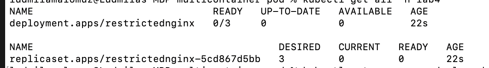

1. Tworzenie przestrzeni nazw o nazwie *lab4*:
```
kubectl create ns lab4
```
2. Tworzenie kwoty zasobów:
```
apiVersion: v1
kind: ResourceQuota
metadata:
  name: pod-demo
spec:
  hard:
    pods: "5"
    requests.cpu: "1"
    requests.memory: 1Gi
    limits.cpu: "1"
    limits.memory: 1Gi
```
*lab4-quota.yaml*

Przypisanie kwoty do przestrzeni nazw *lab4*:
```
kubectl apply -f lab4-quota.yaml --namespace=lab4
```
Sprawdzanie aktualnej kwoty dla podu w *lab4*:
```
kubectl get quota -n lab4
```


3. Tworzenie deployment o nazwie *restrictednginx* z 3 podami:
```
kubectl create deploy restrictednginx --image=nginx -n lab4 --replicas=3
```
4. Sprawdzamy obecnośc deploymentu:
```
kubectl get all -n lab4
```

5. Ustawianie ograniczeń dla deploymentu, gdzie *limits* opisuje górną granicę, a *requests* - ile zasobób początkowo ada kazdy pod:
```
kubectl set resources deployment restrictednginx --namespace=lab4 --limits=cpu=250m,memory=256Mi --requests=cpu=125m,memory=64Mi
```

